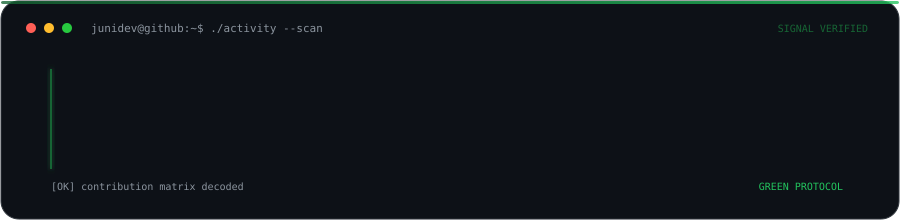

  

  
  
  

  

<h2 align="center">
  
  Sobre mí
</h2>

  Estudiante de Ingeniería Estadística e Informática. 
  Desarrollador Full Stack | Científico de Datos | Entusiasta de la IA. 
   
   Videojuegos &nbsp;·&nbsp;  Series &nbsp;·&nbsp;  Música &nbsp;·&nbsp;  Gatos

<table>
  <tr>
    <td width="33.33%" align="center" valign="top">
       
      <strong>BUILD</strong> 
      <small>Desarrollo full-stack</small>
      
Plataformas web, APIs, autenticación, paneles y bases de datos.

    </td>
    <td width="33.33%" align="center" valign="top">
       
      <strong>ANALYZE</strong> 
      <small>Estadística y aprendizaje automático</small>
      
Análisis de datos reales, clasificación, predicción y evaluación de modelos.

    </td>
    <td width="33.33%" align="center" valign="top">
       
      <strong>SOLVE</strong> 
      <small>IA aplicada y optimización</small>
      
Modelos de Deep Learning, RAG, procesamiento de datos y soluciones escalables.

    </td>
  </tr>
</table>

  

<h2 align="center">
  
  Essential Stack
</h2>

<table align="center" width="840">
  <tr>
    <td width="420" align="center" valign="middle">
      <strong>Lenguajes</strong> 
      &nbsp;<small><small>Python</small></small>&ensp;
      &nbsp;<small><small>JavaScript</small></small>&ensp;
      &nbsp;<small><small>TypeScript</small></small> 
      &nbsp;<small><small>C++</small></small>&ensp;
      &nbsp;<small><small>R</small></small>&ensp;
      &nbsp;<small><small>PHP</small></small>&ensp;
      &nbsp;<small><small>SQL</small></small>
    </td>
    <td width="420" align="center" valign="middle">
      <strong>Desarrollo frontend</strong> 
      &nbsp;<small><small>React</small></small>&ensp;
      &nbsp;<small><small>Next.js</small></small>&ensp;
      &nbsp;<small><small>Angular</small></small> 
      &nbsp;<small><small>HTML</small></small>&ensp;
      &nbsp;<small><small>CSS</small></small>&ensp;
      &nbsp;<small><small>Tailwind CSS</small></small>
    </td>
  </tr>
  <tr>
    <td width="420" align="center" valign="middle">
      <strong>Desarrollo backend</strong> 
      &nbsp;<small><small>Node.js</small></small>&ensp;
      &nbsp;<small><small>NestJS</small></small>&ensp;
      &nbsp;<small><small>Express</small></small> 
      &nbsp;<small><small>Laravel</small></small>&ensp;
      &nbsp;<small><small>FastAPI</small></small>
    </td>
    <td width="420" align="center" valign="middle">
      <strong>Bases de datos</strong> 
      &nbsp;<small><small>MySQL</small></small>&ensp;
      &nbsp;<small><small>PostgreSQL</small></small>&ensp;
      &nbsp;<small><small>MongoDB</small></small> 
      &nbsp;<small><small>Prisma</small></small>
    </td>
  </tr>
  <tr>
    <td colspan="2" align="center" valign="middle">
      <strong>Ciencia de datos y ML</strong> 
      &nbsp;<small><small>TensorFlow</small></small>&ensp;
      &nbsp;<small><small>PyTorch</small></small>&ensp;
      &nbsp;<small><small>NumPy</small></small> 
      &nbsp;<small><small>Pandas</small></small>&ensp;
      &nbsp;<small><small>Scikit-learn</small></small>
    </td>
  </tr>
  <tr>
    <td colspan="2" align="center" valign="middle">
      <strong>Herramientas y DevOps</strong> 
      &nbsp;<small><small>Docker</small></small>&ensp;
      &nbsp;<small><small>Git</small></small>&ensp;
      &nbsp;<small><small>Linux</small></small>&ensp;
      &nbsp;<small><small>Vercel</small></small>
    </td>
  </tr>
</table>

<h2 align="center">
  
  Plataformas de Programación
</h2>

  &nbsp;
  &nbsp;
  

  

  

  

